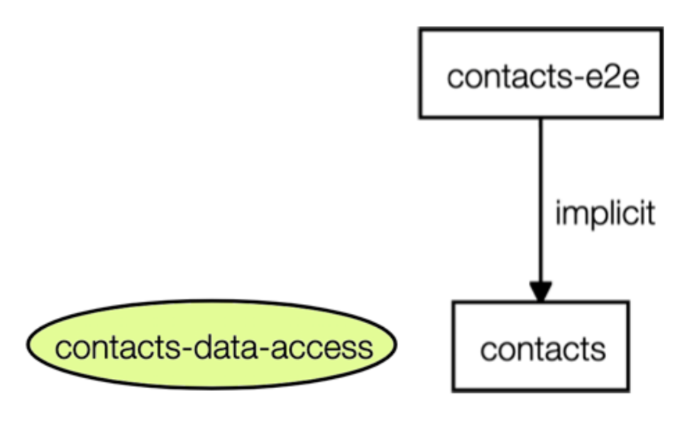

### Lab (2a): Create Data-Access Library

The ContactsService and models are not encapsulated in a distinct, protected library.
Such library can 

* be reused and imported by 1..n UI libraries
* defines a public API that protects access to non-public artifacts.

#### Scenario

Let's create a Data-Access library in `/libs/contacts/data-access`. 




<br>

----

#### Tasks

1. Use a terminal to run the command 
  ``` 
  nx g @nrwl/web:lib data-access --directory=contacts --dryRun
  ```
2. move the contact services files 
  * from `apps/contacts/src/app/services/*/*` 
  * to `/libs/contacts/data-access/src/lib/*/*`
3. update the library public API (index.ts) to export the `Contact` interface and `ContactsService` service.
4. clean up the Contacts app by removing the references to `ContactsService`
5. confirm the `.eslintrc` has the `enforce-module-boundaries` settings shown in the Snippts below. 

<br>


----

**Question**: What else did the schematic do?

Review the changes to `nx.json`, `tsconfig.json`, and `workspace.json`

----

<br>

#### Code Snippets

##### `.eslintrc` (partial)

```console
"@nrwl/nx/enforce-module-boundaries": [
      "error",
      {
        "allow": [],
        "depConstraints": [
          { "sourceTag": "scope:contacts", "onlyDependOnLibsWithTags": ["scope:contacts"] },
          { "sourceTag": "type:e2e", "onlyDependOnLibsWithTags": ["type:app"] },
          { "sourceTag": "type:app", "onlyDependOnLibsWithTags": ["type:feature", "type:util"] },
          {
            "sourceTag": "type:feature",
            "onlyDependOnLibsWithTags": ["type:data-access", "type:ui", "type:util", "scope:shared"]
          },
          { "sourceTag": "type:data-access", "onlyDependOnLibsWithTags": ["type:util", "scope:shared", "type:api"] }
        ],
        "enforceBuildableLibDependency": true
      }
    ]
```    


