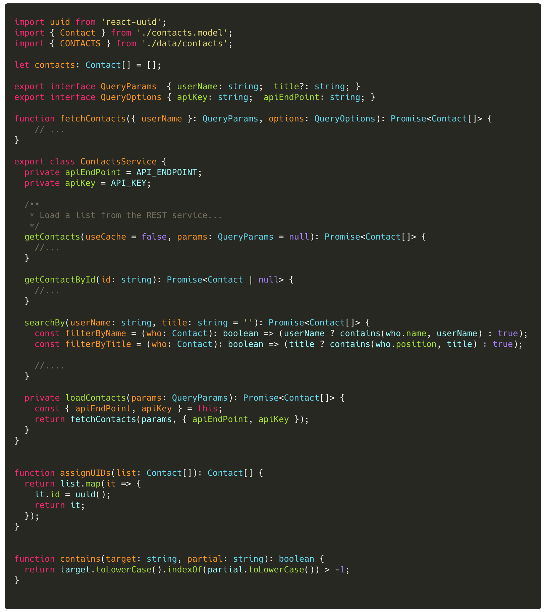

### Lab (1): Add TypeScript Types

Without types developers must infer the proper usages of the `ContactsService`. 

The data returned - while assumed to be `Contact[]` - is ambiguous. Neither the IDE nor the compiler enforce that assumption.

#### Scenario

The current ContactsService class does not specify any types. 

Let's add type information to all variables, function parameters, and function return values. 

 

----

#### Tasks

1. Add type information to the JSON array of contacts
2. Add types to the `ContactsService` in `apps/contacts/src/app/services/contacts.service.ts`.
  * Add `QueryParams` and `QueryOptions`  interfaces for use in the `fetchContacts` method
  * Add parameter and return types to all functions.
  * Add types to `filterByName` and `filterByTitle`

----

 

#### Code Snippets

##### `apps/contacts/src/app/services/data/contacts.ts`

##### `apps/contacts/src/app/services/contacts.service.ts`

