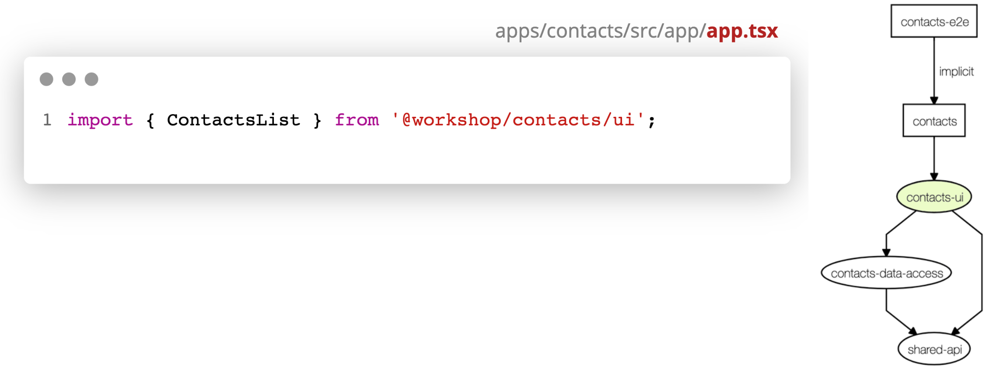
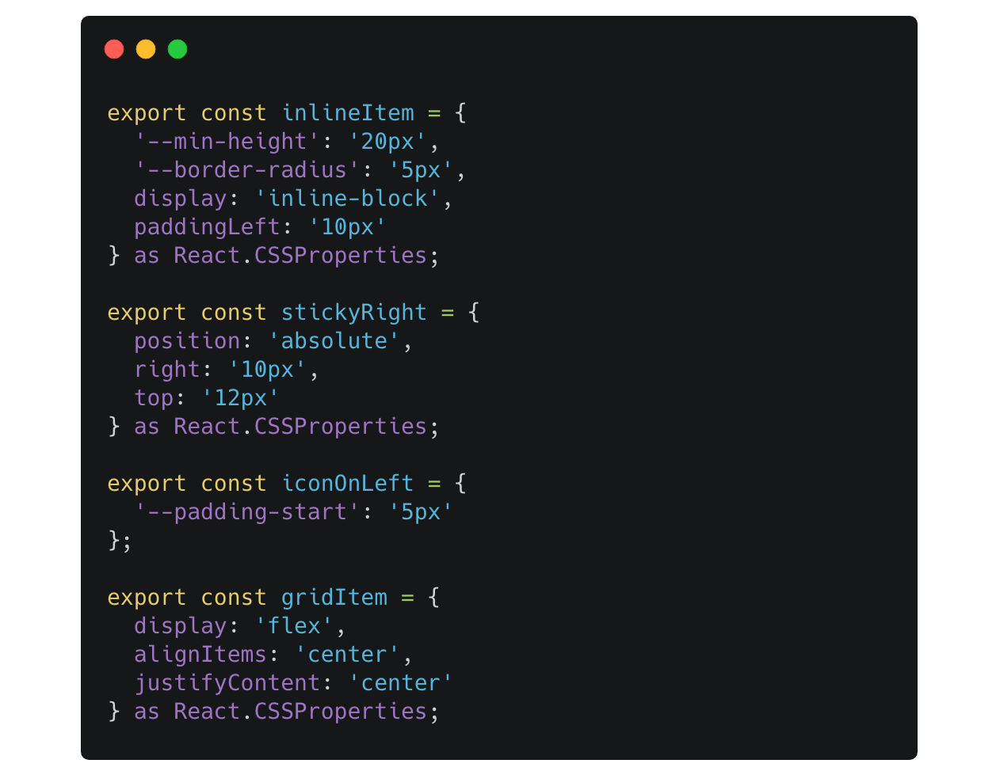
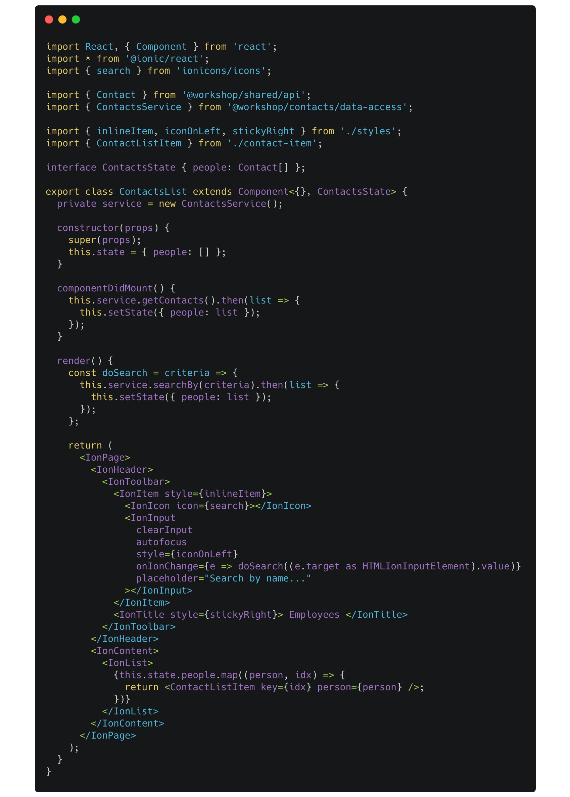
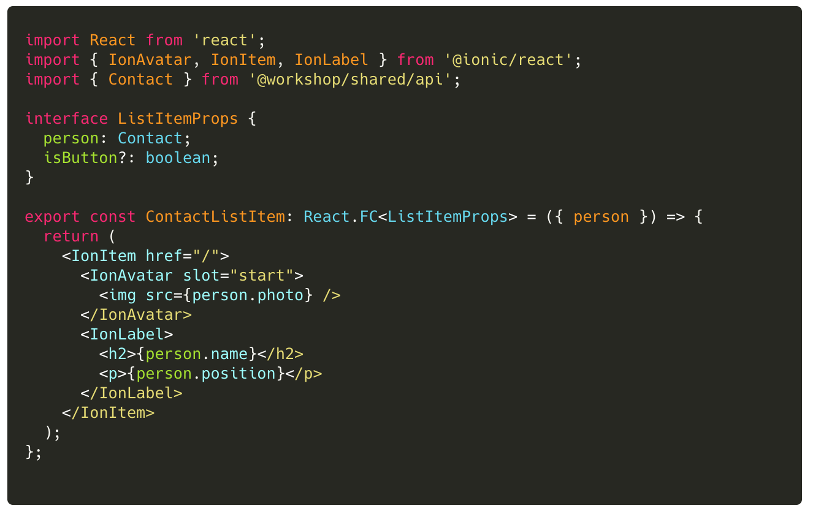
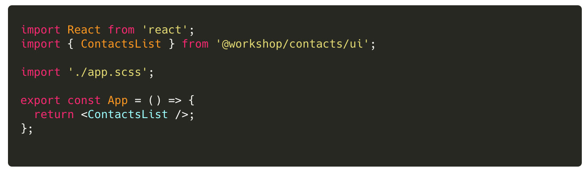

### Lab (3a): Create UI Library

Let's use the `@ionic/react` component library and create custom feature library for Contacts.
This library contains the business UI features / workflow for contacts: List, ListItem, and Details.

#### Scenario

:::success
Use Nx tools to create a React UI library at `libs/contacts/ui`.
:::

This library will

- contain the React UI components ContactsList and ContactItem,
- import and use the `@workspace/contacts/data-access` library,
- will be constrained so only App can import this library.



<br>

---

#### Tasks

1. Use a terminal to run the command

```console
nx g @nrwl/react:lib ui --directory=contacts --dryRun
```

3. Create a UI library style definitions in `libs/contacts/ui/src/lib/styles.ts`
4. Create a React Component **ContactsList**
5. Create a React Component **ContactItem**
6. update the UI library public API to export the `ContactsList` view component.
7. Update the Contacts app to import and use the ContactsList
8. Remove the `body { background-color:...}` in `apps/contacts/src/app/app.scss`

<br>

:::warning
Do you know what a feature library is?
Be prepared to talk about `@workshop/contacts/ui`... where did this come from?
:::

---

<br>

#### Code Snippets

<br>

##### `libs/contacts/ui/src/lib/styles.ts`

[](https://bit.ly/2Vk7yBA)

##### `libs/contacts/ui/src/lib/contact-list.tsx`

[](https://gist.github.com/ThomasBurleson/92bd34c3317bf4c22b1b6d2d2b946ff3)

> Note: the `import * from '@ionic/react';` is wrong. Why? 

##### `libs/contacts/ui/src/lib/contact-item.tsx`

> Note: Why we have **not** yet discussed Functional components, we are using it here because we are only rendering input **props**. We are not concerned about any lifecycle events except `render()`... and FC are perfect for this!



##### `apps/contacts/src/app/app.tsx`


