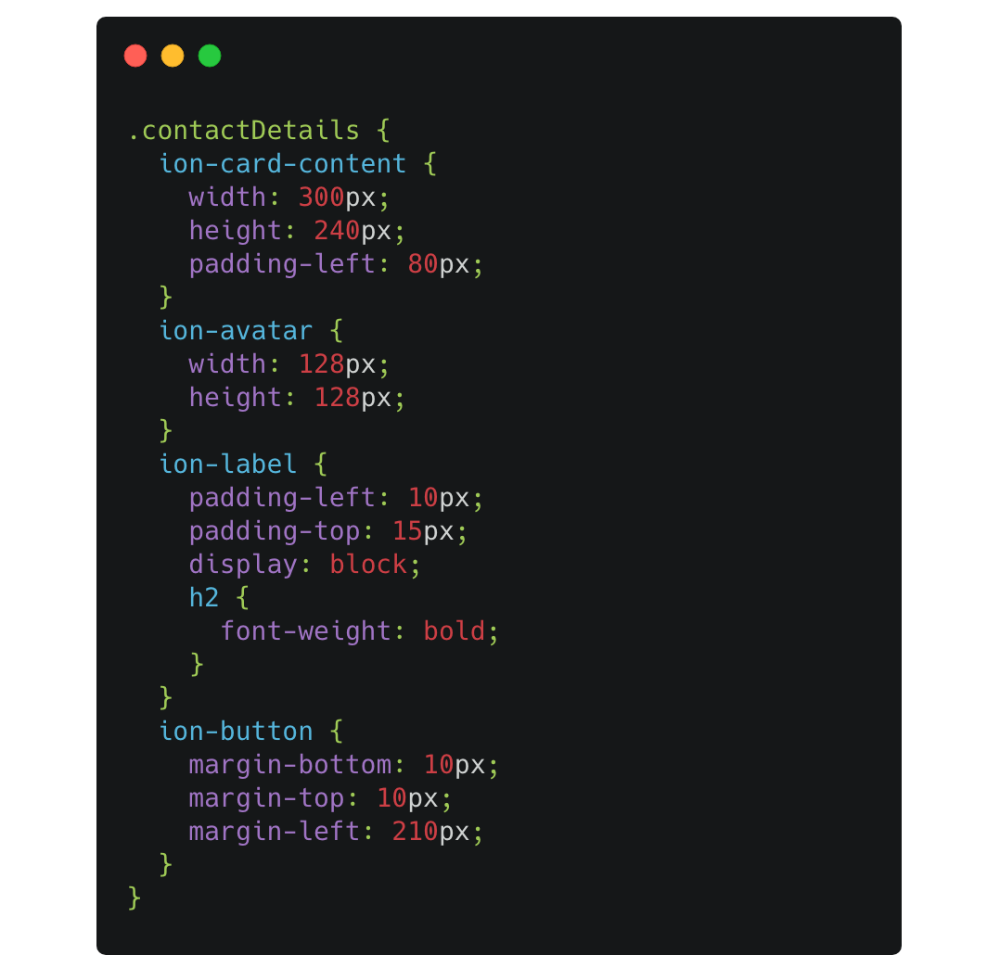
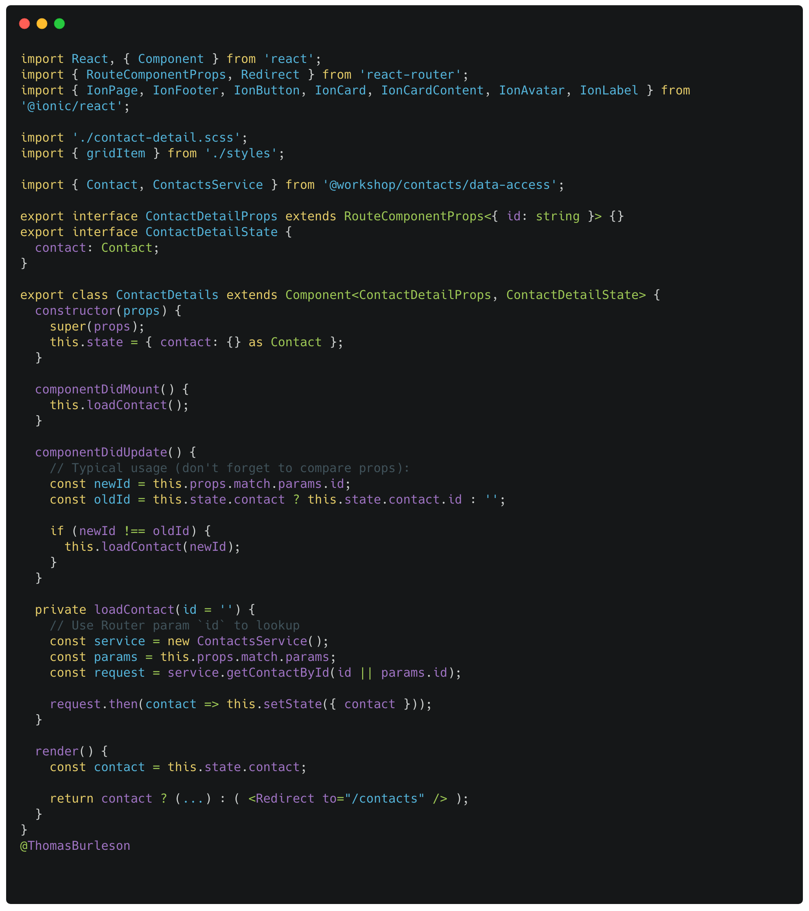
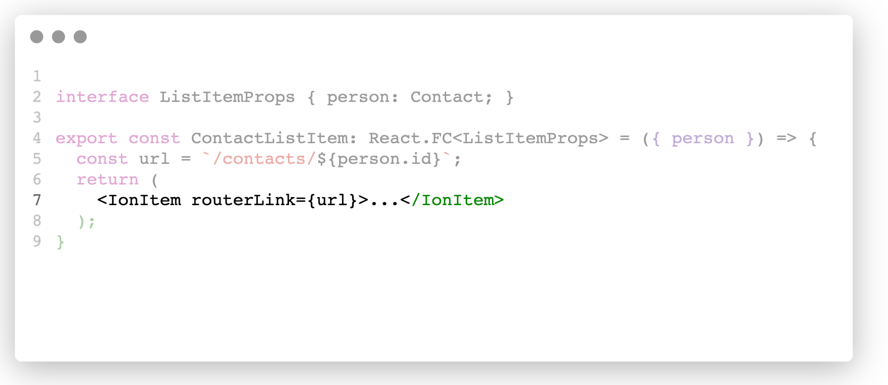
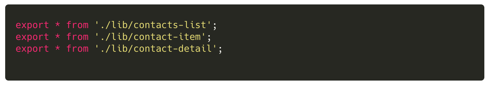
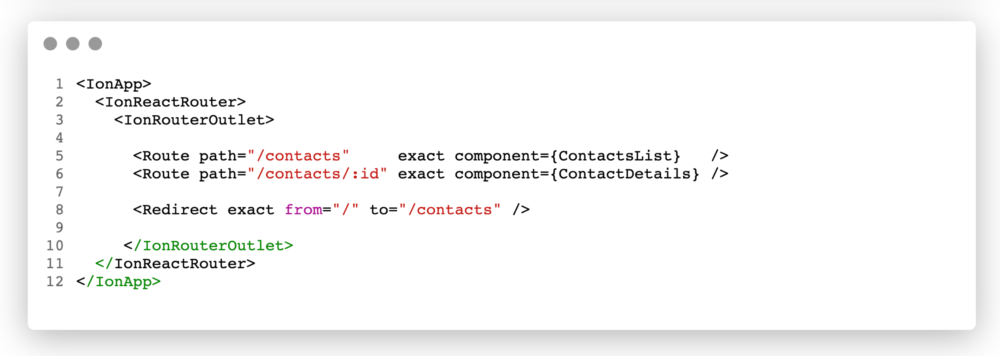

### Lab (3b): Add UI Routing

For our application we want to navigate between the master (`ContactsList`) and detail (`ContactDetail`) views. This routing will also require us to use the Router param information to dynamically lookup the contact information.

#### Scenario

Let’s use the `@ionic/react-router` library (easily replaced btw with React Router) to route between the `ContactsList` and the `ContactDetail` views.

In the _ContactDetail_ use the Router param `id` to dynamically lookup the contact information and render the detail view.

- Add the `ContactDetail` view component to the `libs/contacts/ui` library,
- Add a `routerLink` option to the `ContactItem` (in the ContactsList),
- Update the public API for the `@workspace/contacts/ui`
- Add routing to the Contact app component in `apps/contacts/src/app.tsx`

 

---

#### Tasks

3. Create a React style sheet `contact-details.scss`
4. Create a React Class Component `ContactDetail`
5. Modify the ContactItem to use a `routerLink`
6. Update the UI library public API to export `ContactDetail`
7. Setup routing in the Contact App

 

:::danger
Notice how lifecycle methods used in the `ContactDetail` component.
:::

---

 

#### Code Snippets

 

##### `libs/contacts/ui/src/lib/contact-detail.scss`

##### `libs/contacts/ui/src/lib/contact-detail.tsx`

##### `libs/contacts/ui/src/lib/contact-item.tsx`

##### `libs/contacts/ui/src/index.ts`

##### `apps/contacts/src/app/app.tsx`

