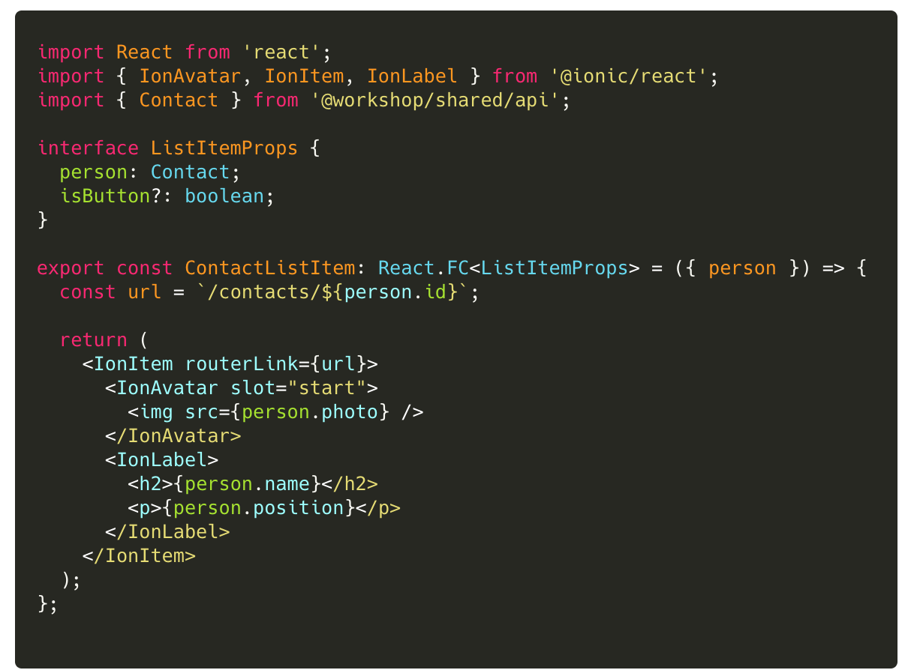
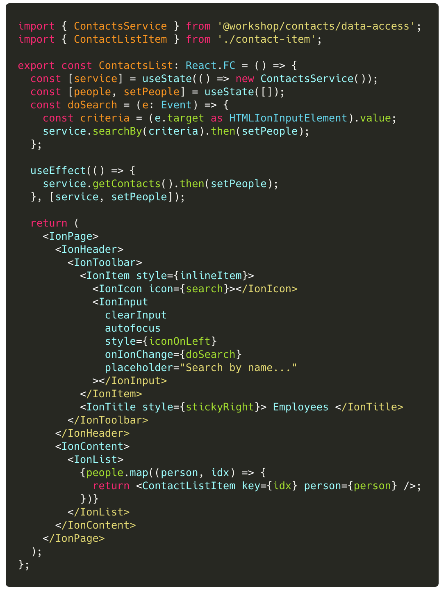

### Lab (4): Use Functional Components

Facebook recommends using Functional Components.

Let's convert our class-based components to functional components and specify type information to maximize productivity. With FC(s), we will also use React hooks to manage local state, centralize logic, and reduce the complexity of the view component code.

Finally we will also add keyboard support to auto-close the Detail view when the 'Escape' key is selected.

#### Scenario

Convert each of the following class-baed components to functional components.

- ContactsList: `libs/contacts/ui/src/lib/contacts-list.tsx`
- ContactDetail: `libs/contacts/ui/src/lib/contact-detail.tsx`

 

---

#### Tasks

1. Refactor ContactList to be a Functional Component
2. Refactor ContactDetail to be a Functional Component. Also add some code to listen for "Escape" keydowns and auto-navigate back to the list

 

> Notice how the components are much cleaner with the logic localized in the `render()` function? Be prepared to talk about your thoughts on FC(s) and hooks.

---

 

#### Code Snippets

 

##### `libs/contacts/ui/src/lib/contact-item.tsx`

> Be prepared to discuss why React hooks were NOT used (eg. `useParams()` or `useState()`).

##### `libs/contacts/ui/src/lib/contact-list.tsx`

##### `libs/contacts/ui/src/lib/contact-details.tsx`

This code snippet is NOT provided. You must solve this yourself.

> You may use the functional component `contact-list-item.tsx` as a guiding example if needed.
