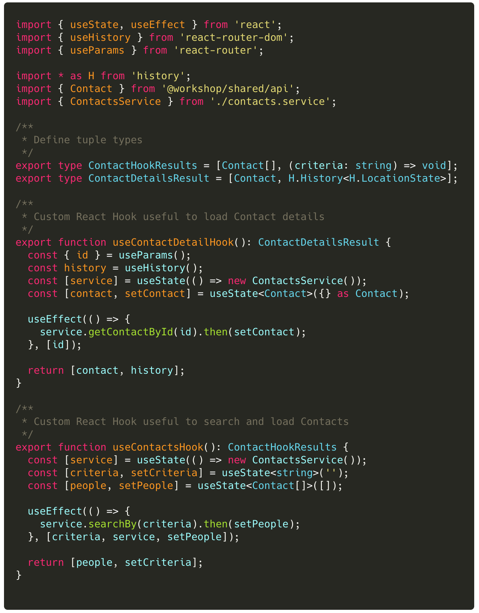
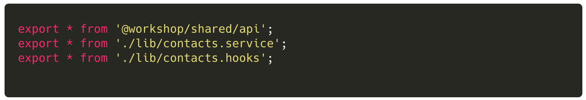
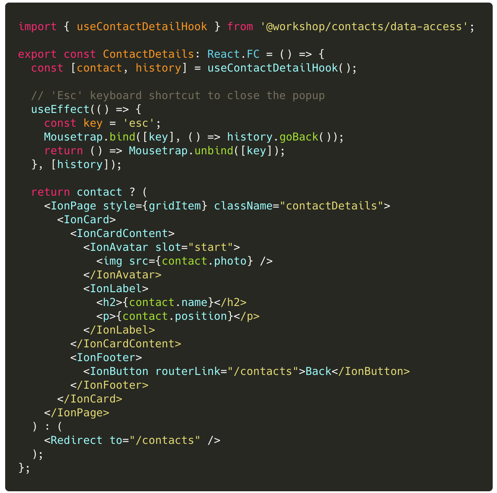
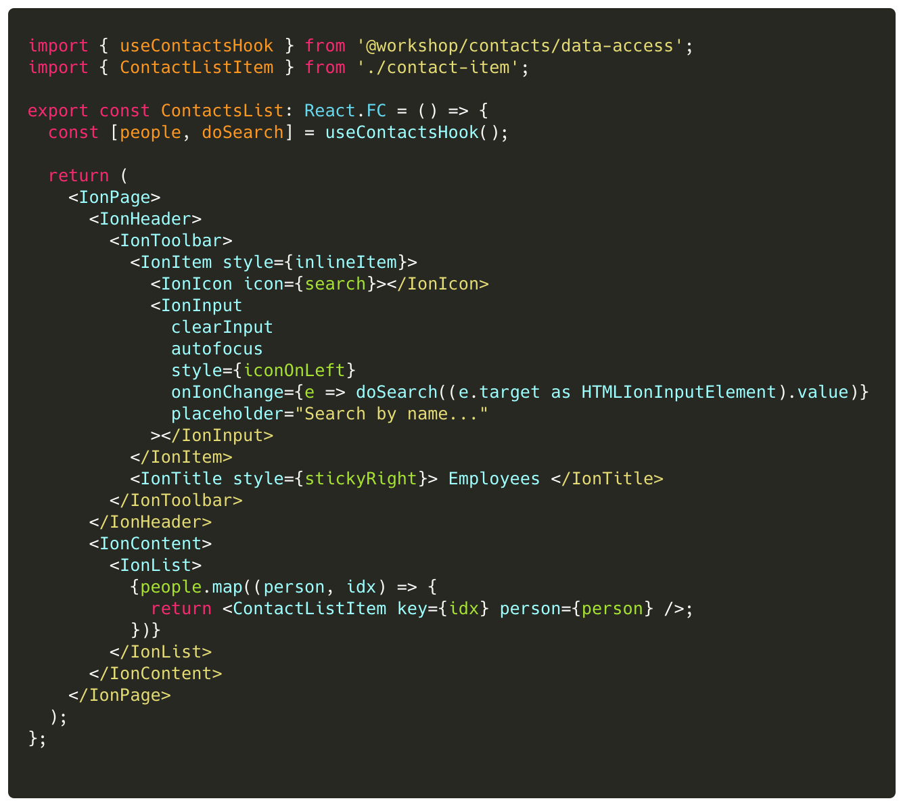

### Lab (5): Create Custom Hooks

Our view components now use React hooks and manifest significantly easier code. Yet the views still have too much logic.
Let's refactor our code to use custom hooks that hide all state logic and update triggers.

With these changes, the custom hooks will also give the 'latest' data to the view for rendering. And - in the case of the `ContactsList` - the actual search functionality is also hidden in the custom hook.

:::success
Our views now become presentational components!
:::

#### Scenario

To use Custom hooks, let's

- Create a `contacts.hooks.ts` module for our custom hooks
- Refactor the React Hooks from the View components to the `contacts.hooks.tsx`
- Define the tuples that the hooks return to the views
- Update the View components to use the new custom hooks

> Be prepared to talk about your thoughts regarding custom hooks.

 

---

#### Tasks

1. Create `libs/contacts/data-access/src/lib/contacts.hooks.ts`
   - Refactor the React Hooks code from **ContactsList**
   - Refactor the React Hooks code from **ContactDetails**
   - Define tuples that will be returned to the functional view components
1. Update the Data-Access library Public API to expose the custom hooks
1. Update **ContactDetails** to use the custom hook
1. Update **ContactList** to use the custom hook

 

:::success
Notice how the the function components are now essentially presentational components.
:::

> Be prepared to talk about your smart components vs presentational.

---

 

#### Code Snippets

 

##### `libs/contacts/data-access/src/lib/contacts.hooks.ts`

##### `libs/contacts/data-access/src/lib/index.ts`

##### `libs/contacts/ui/src/lib/contact-detail.tsx`

##### `libs/contacts/ui/src/lib/contacts-list.tsx`

