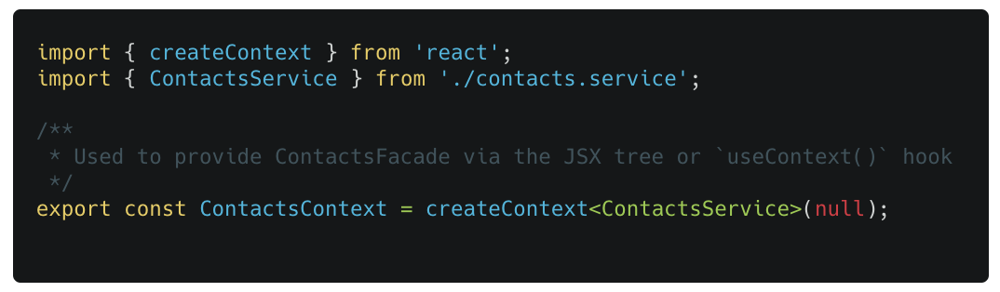
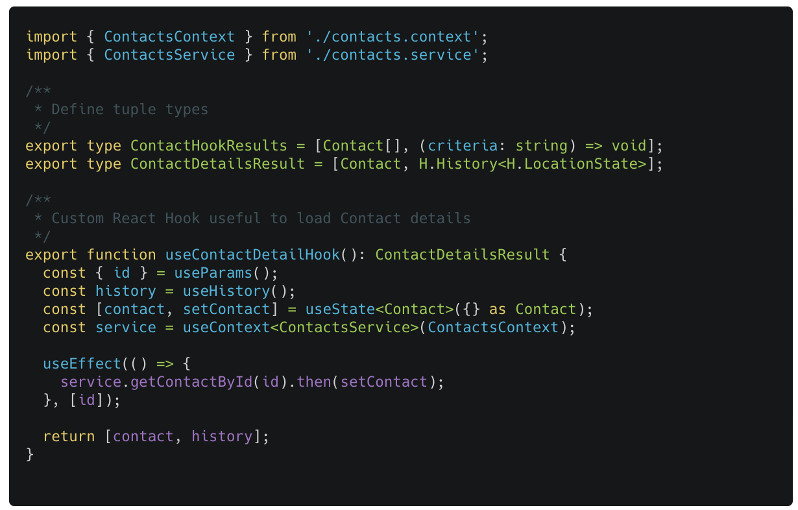
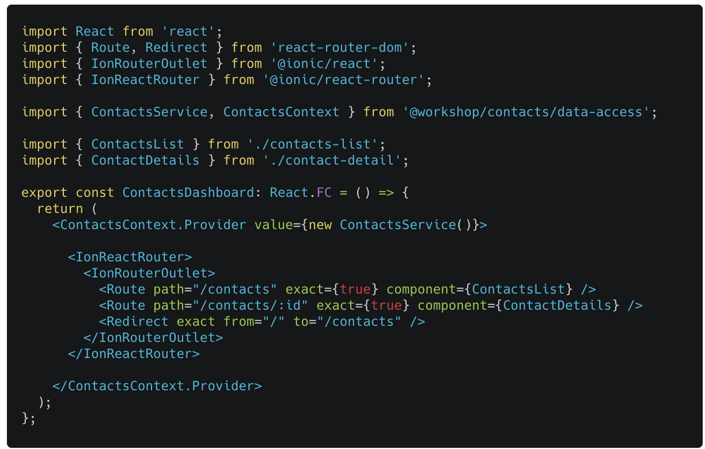

### Lab (6a): Using Context

Both the `ContactsList` and the `ContactDetail` hooks create new instances of the `ContactsService`.

:::danger
The service instance is not shared!
:::

#### Scenario

We can share the instance using React Context(s).

The **Context** provides a way to pass data through the component tree without having to pass props down manually at every level. This approach allows use to provide a lookup mechanism in the view hierarchy... that is accessible from our custom hooks.

Please refer to the React documentation for details on the Context API and [`useContext()`](https://reactjs.org/docs/context.html) hook.

#### Tasks

To use the Context features and sharing the service instance:

- Define a ContactsContext object in `libs/contacts/data-access/src/lib/contacts.context.tsx`.
  - Update the Data-Access API to expose the `ContactsContext`: update the exports from the `index.ts` public barrel file.
- Refactor the `contacts.hooks.ts` React hooks to employ `useContext()` to get access to the service instance.
- Let's refactor our routing to **ContactsDashboard** in `libs/contacts/ui/src/lib/contacts.dashboard.tsx`.
  - Modify the App to use only the **ContactsDashboard**
  - Update the UI library API to expose the **ContactsDashboard**
  - Use the `ContactsContext` wrapper with `value={service}` to provide the service instance.

#### Considerations

Be prepared to talk about your thoughts regarding Contexts. What are the downsides?

---

#### Code Snippets

##### `contacts.context.tsx`

##### `contacts.hooks.ts`

##### `contacts.dashboard.tsx`

