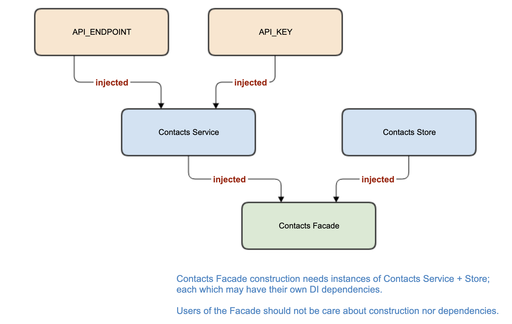
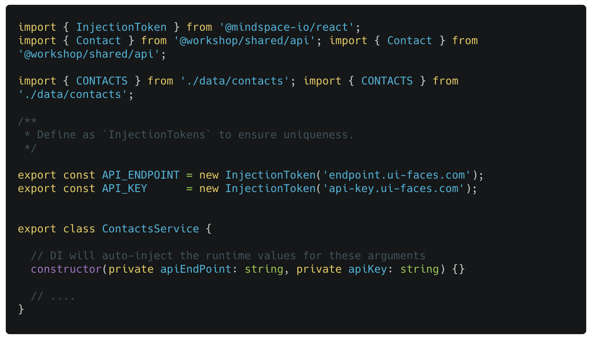
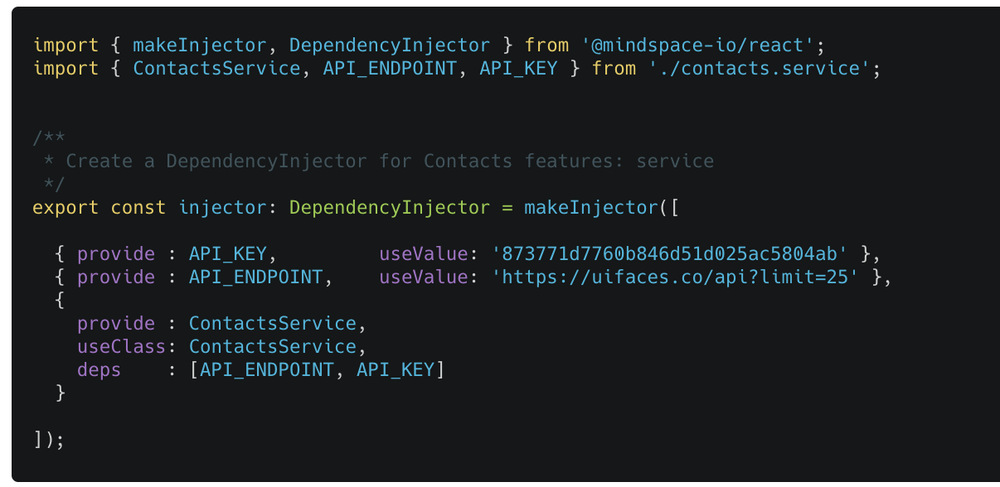
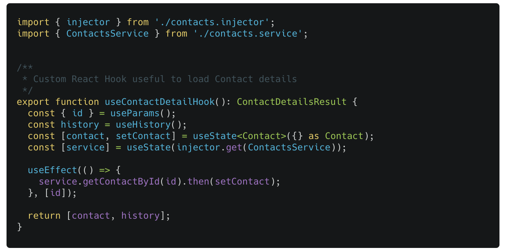

### Lab (6b): Using Dependency Injection

Context provides a mechanism for sharing instances & data. It does not, however, help the developers.

- Does not partition service construction separate from service usages,
- Does not provide for memory caching of service instances,
- Does not provide for universal lookups.

We need a Dependency Injection mechanism to solve these issues. Please read the [**Universal Dependency Injection**](https://medium.com/@thomasburlesonIA/https-medium-com-thomasburlesonia-universal-dependency-injection-86a8c0881cbc) blog article for details.

Leveraging the new DI solution give us more options and may allows us to deprecate the use of Context API.

#### Scenario

To use Dependency Injection:

- Define a custom DependencyInjector
- Update the ContactsService to support DI
- Update the Contact Hooks to use the custom injector (instead of `useContext()`)
- Remove the ContactsContext

> How would you compare DI to Context? Be prepared to talk about your thoughts regarding DI.

#### Tasks

1. Update the `contacts.service.ts` to export `InjectionToken` for our urls and constants
   > Do not forget to define a constructor that expects the DI to provide/inject two URLs as arguments.
2. Create a new ES6 module `contacts.injector.ts` in the data-access library. Define your custom injector using `makeInjector()`.
3. In the `contacts.hooks.ts` remove the use of the `useContext()` hook; replace it with use of your new injector `injector.get(ContactsService)`.

#### Code Snippets

#### `contacts.service.ts`

##### `contacts.injector.ts`

#### `contacts.hooks.ts`

