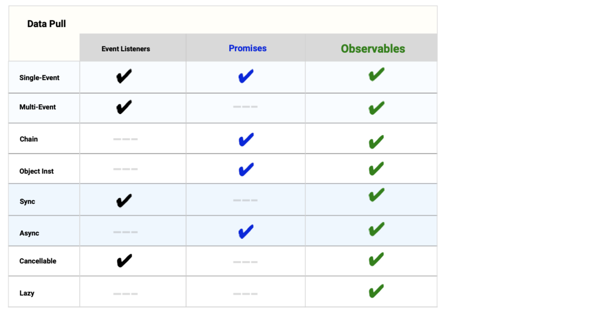
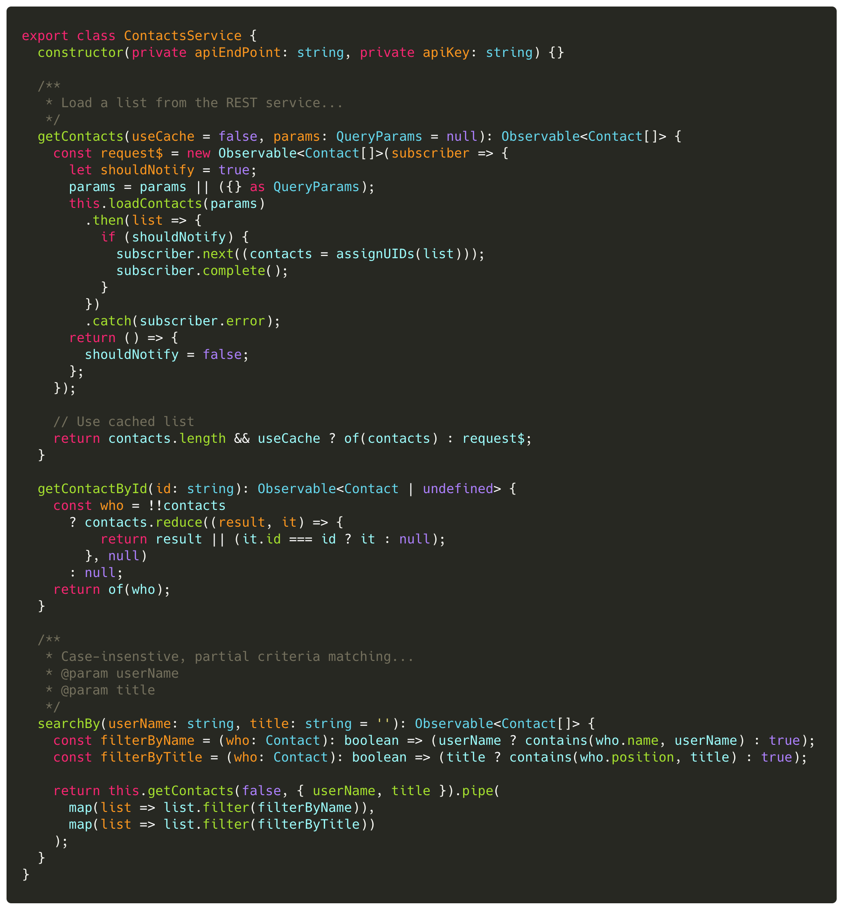
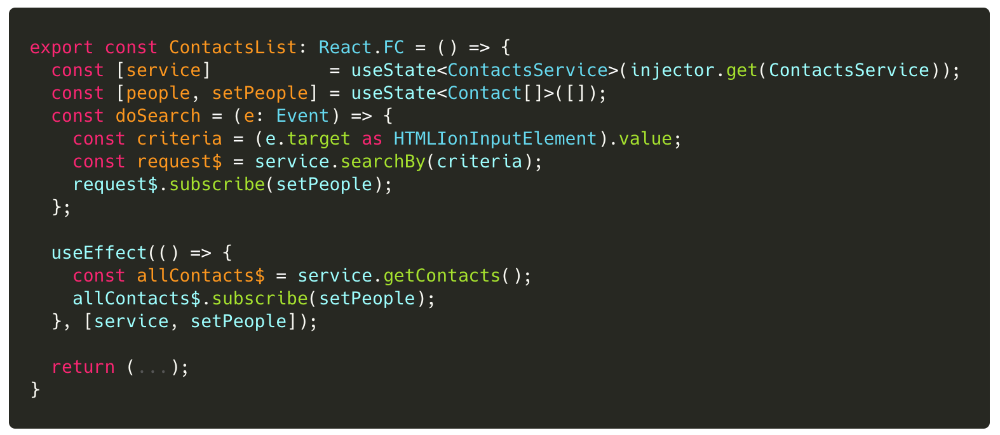
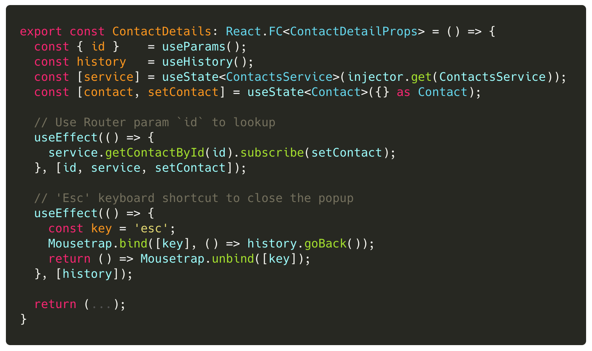

## Lab 1: ‏‏‎ ‎‏‏‎ ‎‏‏‎ ‎Convert Promises to Observables

In the Jumpstart code, we used `Promise<T>` for our asynchronous solutions. While better than the raw EventListener API, Promises have limited features as we recall below:

Now that we have learned about Observables, let's convert our code to use Observables. We will also use RxJS operators to transform our data.

### Tasks

1. Convert the `ContactsService` to use Observables.
2. Update the `ContactList` React component to use the new Observable API in `ContactsService`.
3. Update the `ContactDetail` React component to use the new Observable API in `ContactsService`.

### Code Snippets

##### `libs/contacts/data-access/src/lib/contacts.service.ts`

##### `libs/contacts/ui/src/lib/contacts-list.tsx`

##### `libs/contacts/ui/src/lib/contact-detail.tsx`

