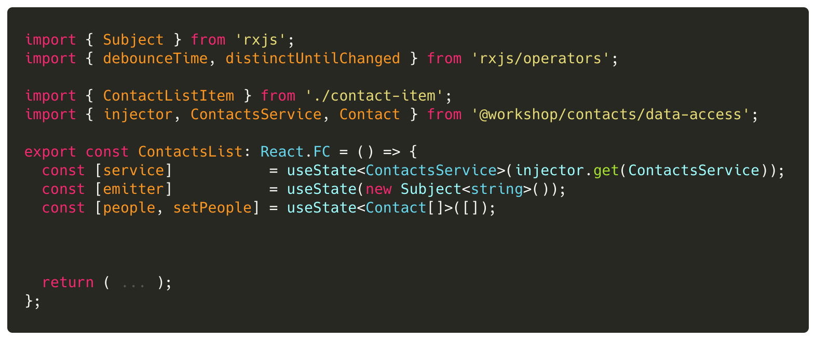
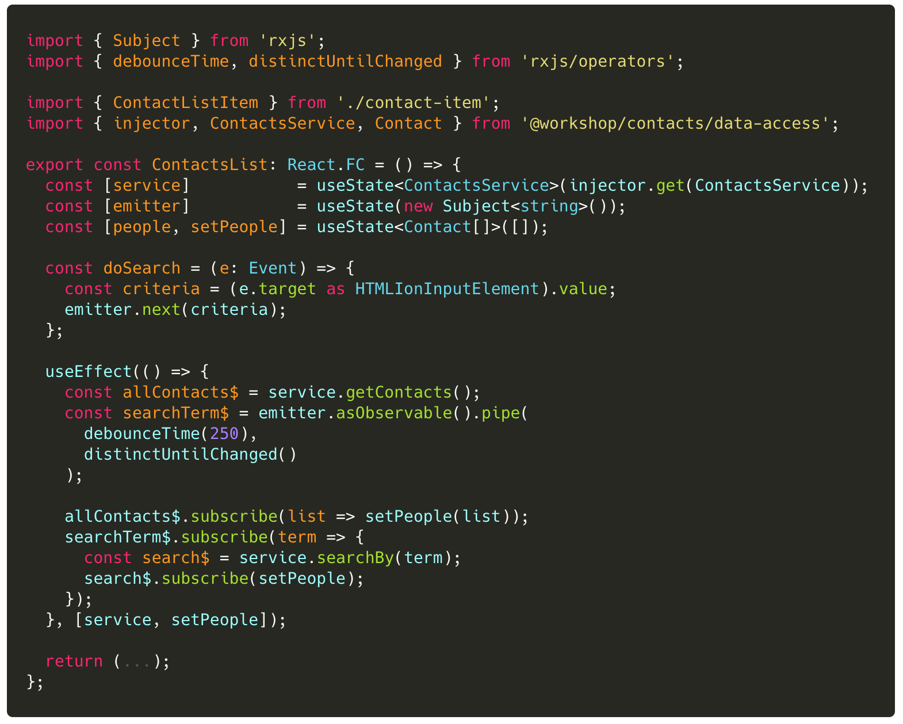

## Lab 2: ‏‏‎ ‎‏‏‎ ‎‏‏‎ ‎Debounce and deduplicate terms

The goal of this exercise is to fine-tune the existing implementation of our instant search to leverage the power of observables. We will debounce and deduplicate the user supplied search terms in order to reduce the pressure on the server and increase scalability.

We need to stream the '**search by name**' input control changes through an Observable... so that we can use the power of the `debounce` and `distinctUntilChanged` operator to reduce the number of requests made to the server.

In ContactsList component, create a `Subject` instance that will be used from within the template. As the input control value changes, we will push the search term values into the Observable stream .

### Tasks

1. Create an `emitter` Subject in `ContactsList` that can be used from the template to propagate the input changes

- import `Subject` from `rxjs`
- create an `emitter` state that is an instance of `new Subject()`
- Update the ` doSearch()`` event handler to call `emitter.next(\$event.target.value)`:::info Make sure to import`debounceTime`and`distinctUntilChanged` RxJS operators.
  :::

2. Since `emitter` will be used to push the search criteria through a stream, we want to use the RxJS operators `debounceTime(400)` and `distinctUntilChanged()` to reduce the number of requests made to the server.
3. Inside the `useEffect()`, create stream references: `allContacts$`, `searchTerm$`. Listen for data emissions on both of these streams.

### Code Snippets

###### `contacts-list.tsx`

> Be prepared to talk about any issues with this approach.
