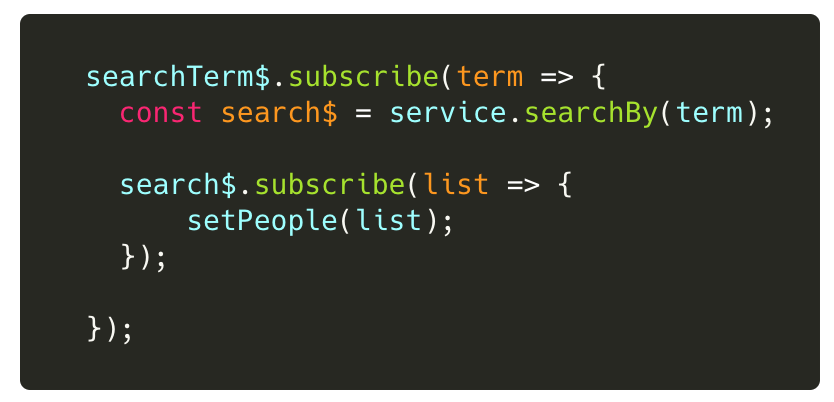
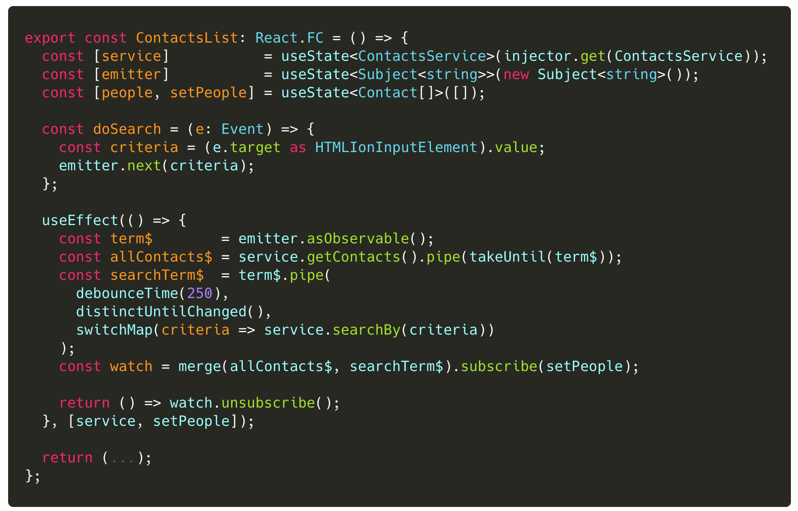

## Lab 3: ‏‏‎ ‎‏‏‎ ‎‏‏‎ ‎Out-of-Order Responses & Zombies

Asynchronous requests are tricky.

- How do we guarantee that the response is recieved for a specific request?
- How do we cancel a current _pending_ request; in order to issue a new request?
- How do we queue a batch set of requests?

Even more important is: "How do we avoid nested `subscribe()` calls?"

:::danger
We must use the powerful RxJS operator `switchMap()` to both

- avoid nested subscribes, and
- cancel possible inflight requests.
  :::

#### Combining Streams

We actually have two (2) data streams: `allContacts$` and `searchTerm$`. We need to use the RxJS `merge()` to combine both streams into a single stream.

If the user starts searching BEFORE the allContacts\$ loads, we need to cancel that request to load all contacts... so we see only the results for the searched contacts.

 

### Tasks

1. Update the `ContactsList` component to `merge` both streams, use `switchMap` to cancel inflight requests, and use `takeUntil` to cancel the default load (if needed).

> Hint: Use three (3) separate variables for the (3) streams.
