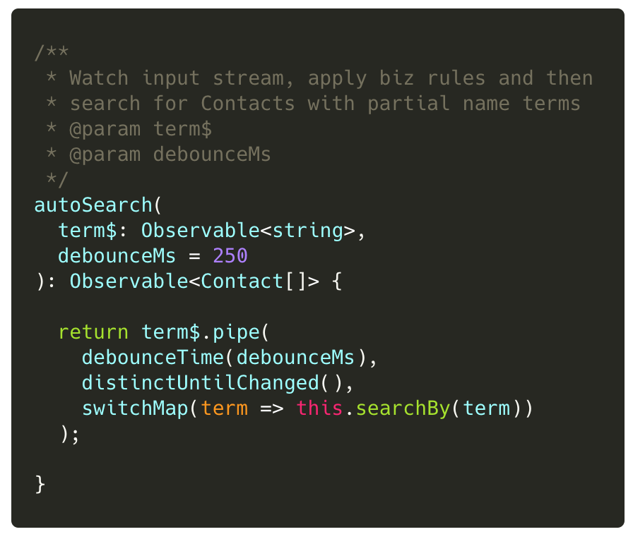
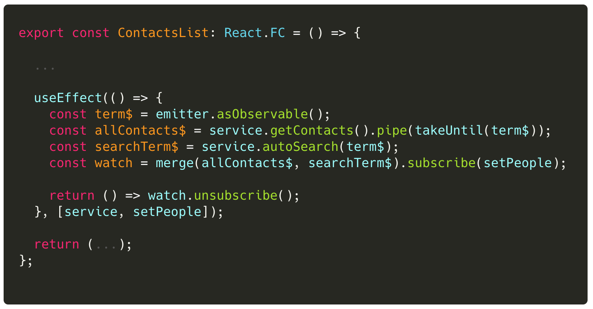

## Lab 4: ‏‏‎ ‎‏‏‎ ‎‏‏‎ ‎Refactor Stream Logic into Search API

Currently our view component `ContactsList` has code to `debounce`, `distinctUntilChanged`, and `switchMap`.

:::danger
This is logic that should be refactored to the business layer.
:::

Let's update our `ContactsService` API to handle **input** streams.

### Tasks

1. Update `ContactsService` to add a new method `autoSearch()`
2. Update `ContactsList` to use the new `ContactsService::autoSearch()` API.

### Code Snippets

##### `libs/contacts/data-access/src/lib/contacts.service.ts`

##### `libs/contacts/ui/src/lib/contacts.list.tsx`

