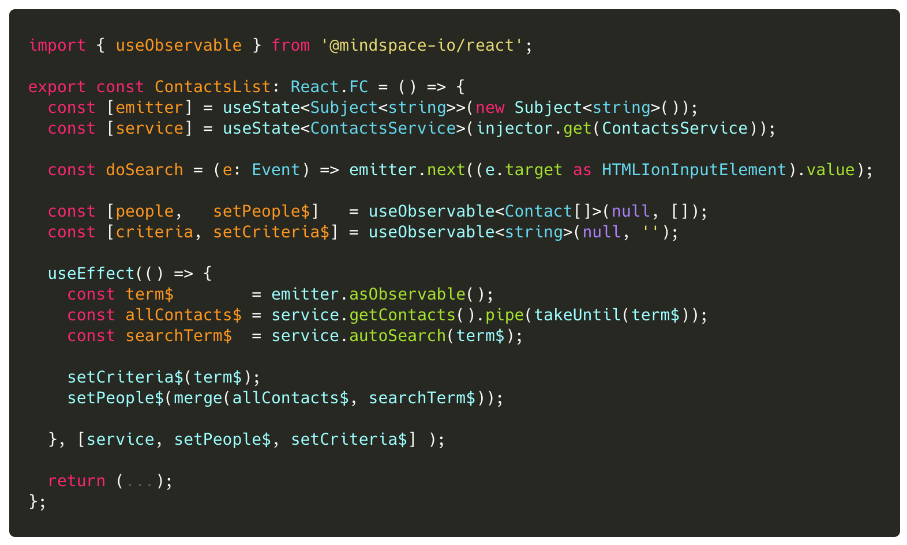

## Lab 5: ‏‏‎ ‎‏‏‎ ‎‏‏‎ ‎Using `useObservable()`

Subscriptions are used to **extract** data that is emitted through an Observable stream. Yet, one the more challenging parts of Observables is that of managing subscriptions.

:::danger
The goal is to avoid explicit `subscribe()` calls as much as possible.
:::

**@mindspace-io/react** publishes a custom hook `useObservable(stream)` that:

- auto subscribes to `stream`
- publishes (in a tuple) both the emitted data AND setter function to watch a new observable (if needed)
- auto-unsubscribes from an existing stream before subscribing to the new stream
- auto-unsubscribes when the host view component unmounts

:::success
Let's use this new custom hook `useObservable()` to simplify our code.
:::

---

 

### Tasks

1. Import `useObservable` from the `@mindspace-io/react` package/library.
2. Use the hook to create/manage the `[people, setPeople$]` tuple.
3. Use the hook to manage the `[criteria, setCriteria$]` tuple.
4. Update `useEffect()` to use both setter functions (which set Observables... not raw data).

 

### Code Snippets

