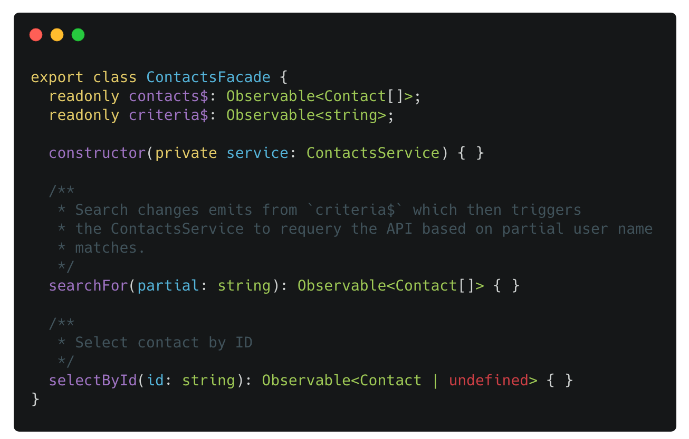
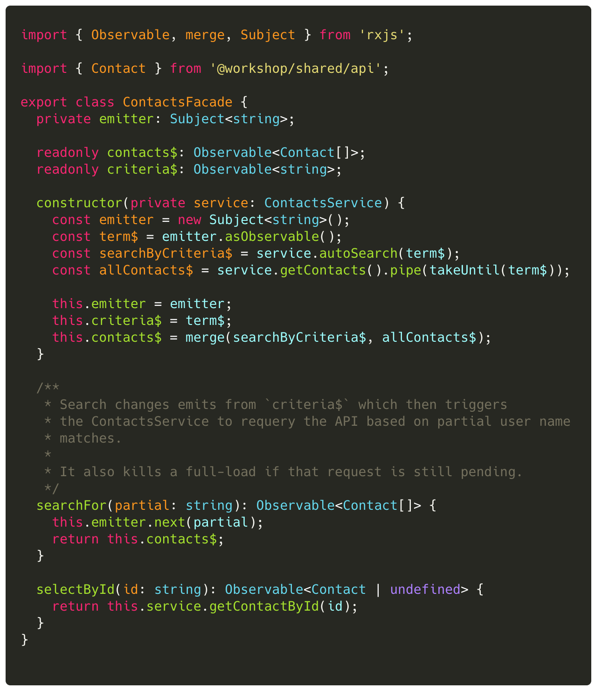
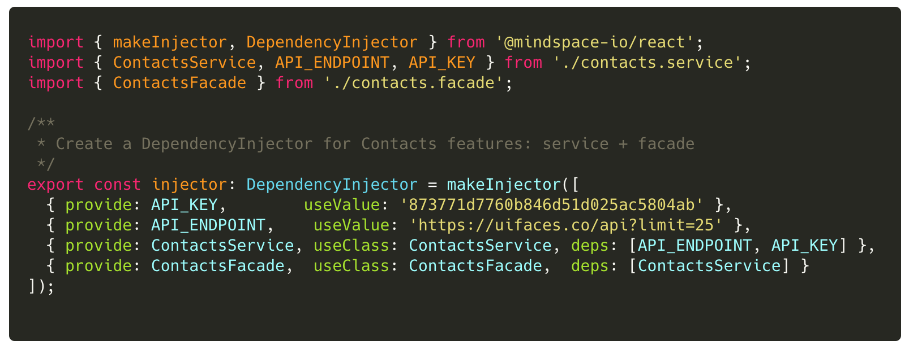
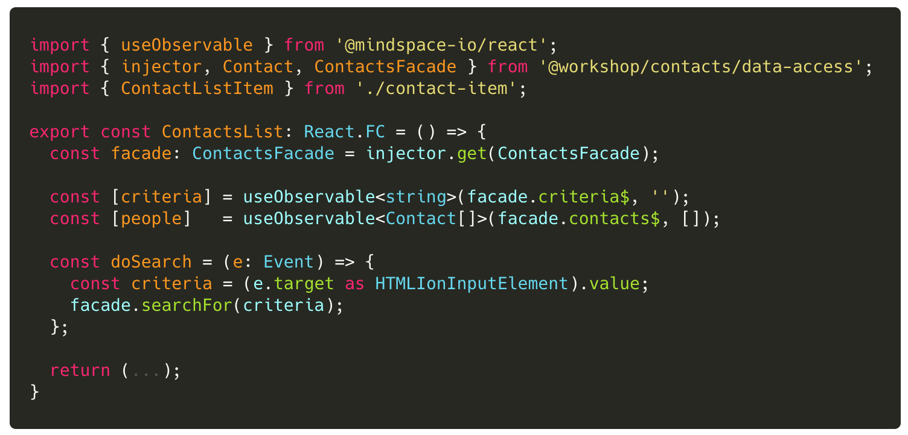
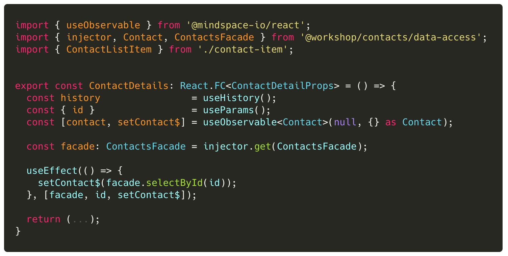

## Lab 6: ‏‏‎ ‎‏‏‎ ‎‏‏‎ ‎Facades as View Models

Facades allow developers to

- hide complexity
- publish simple API + data models to views
- support 1-way data flows to-from the UI layers

Let's create a `ContactsFacade` that supports the following API:

> Notice that the `ContactsFacade` has an instance of the ContactsService injected into the constructor via DI

 

The API maintains the circular, 1-way data flow:

- Data flows outputs (from the facade) are ONLY via streams.
- Inputs are ONLY methods into the Facade

---

 

### Tasks

1. Implement the `ContactsFacade` at `libs/contacts/data-access/src/lib/contacts.facade.ts`
2. Ensure you export the Facade from the library public API (see `libs/contacts/data-acess/src/index.ts`)
3. Register the `ContactsFacade` class with the dependency injection (DI) engine (see `libs/contacts/data-access/src/lib/contacts.injector.ts`)
4. Update the `ContactsList` view component to use the `ContactsFacade` instead of the `ContactsService`
5. Update the `ContactDetail` view component to use the `ContactsFacade` instead of the `ContactsService`

 

### Code Snippets

##### `libs/contacts/data-access/src/lib/contacts.facade.ts`

 

##### `libs/contacts/data-access/src/lib/contacts.injector.ts`

 

##### `libs/contacts/ui/src/lib/contacts-list.tsx`

 

##### `libs/contacts/ui/src/lib/contact-detail.tsx`

 
