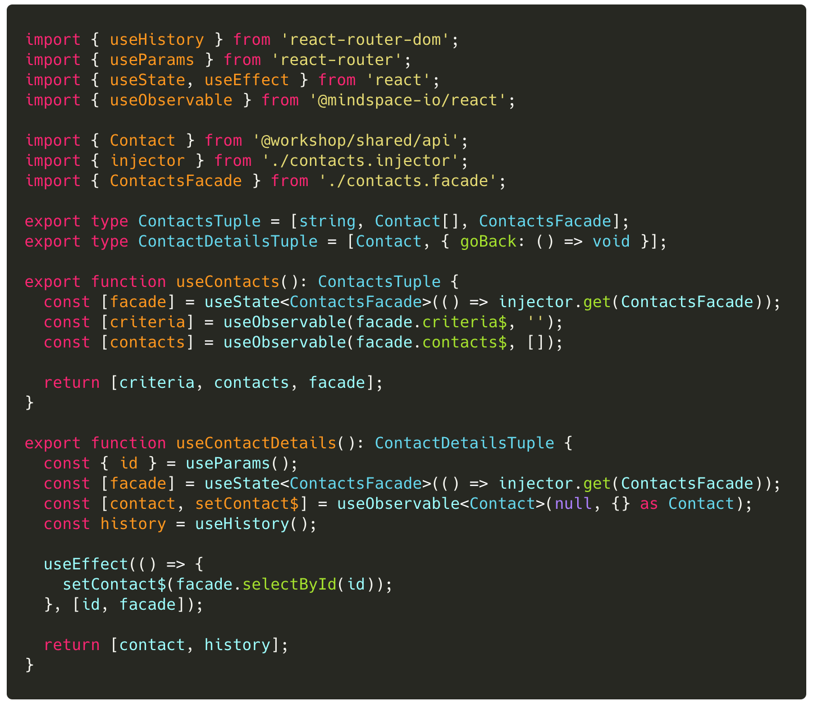
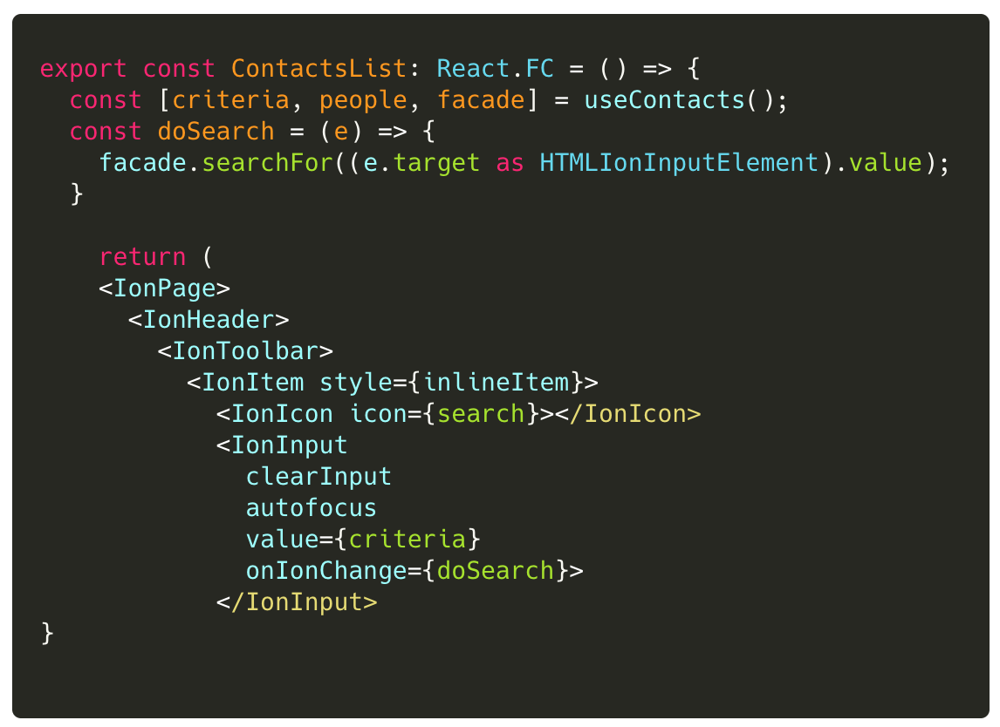
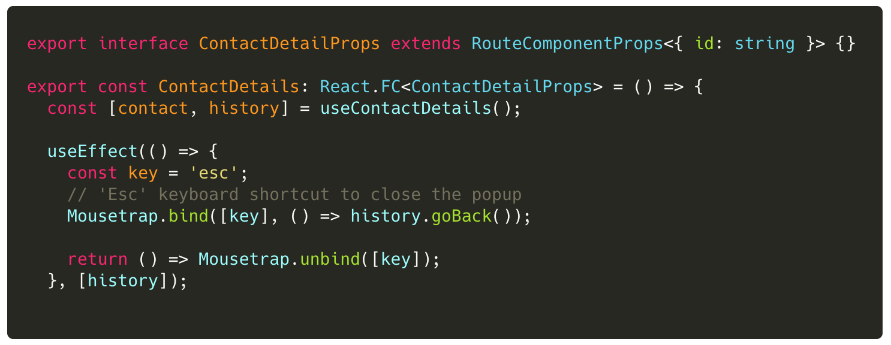

## Lab 7: ‏‏‎ ‎‏‏‎ ‎‏‏‎ ‎Custom Hooks with Facades

In Jumpstart, we learned how custom hooks can also hide complexity.
Let's use custom hooks to hide our usages of the `ContactsFacade` and the `useObservable()` hook itself.

Since each custom hook is used only for a specific view component, we can define the API for each hook:

- `useContacts(): [string, Contact[], ContactsFacade]`
- `useContactDetails(): [Contact, { goBack: ()=>void }]`

:::success
We design the hook tuples to only supply the data and functions needed by the view component!
Notice the `useContactsTuple` returns 3 elements.
:::

---

 

### Tasks

1. Create the custom hooks in `libs/contacts/data-access/src/lib/contacts.hook.ts`
2. Update the public API in `libs/contacts/data-access/src/index.ts`
3. Refactor `ContactsList` to use the `useContacts()` hook.
4. Refactor `ContactDetail` to use the `useContactDetails` hook.

:::warning
Be sure to clean up your imports!
:::

 

### Code Snippets

##### `libs/contacts/data-access/src/lib/contacts.hook.ts`

 

##### `libs/contacts/ui/src/lib/contacts-list.tsx`

 

##### `libs/contacts/ui/src/lib/contact-detail.tsx`

