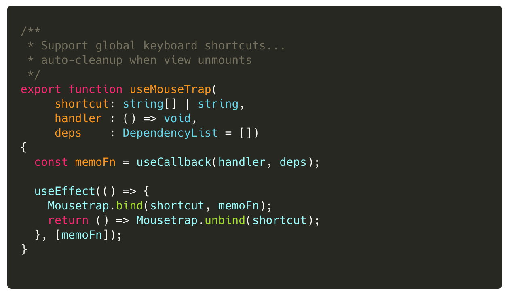
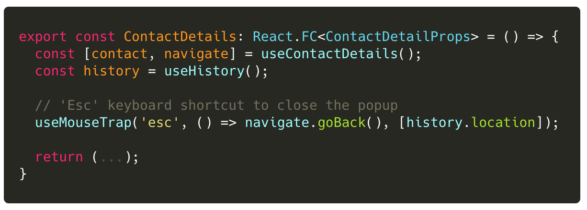

## Lab 8: ‏‏‎ ‎‏‏‎ ‎‏‏‎ ‎MouseTrap Custom Hook

Let's implement another custom hook that enables versatile re-use of MouseTrap shortcut key handler.

---

 

### Tasks

1. Implement the custom hook in `useMouseTrap()`
2. Update the `ContactDetails` view to use this hook.

 

### Code Snippets

##### `libs/contacts/data-access/src/lib/contacts.hook.ts`

:::info
Be sure prepared to talk about the best location to publish this hook.
:::

 

 

##### `libs/contacts/ui/src/lib/contact-detail.tsx`

 

---

 

:::success
Thanks to Jimmy Guzman for this excellent enhancement and contribution!
:::
